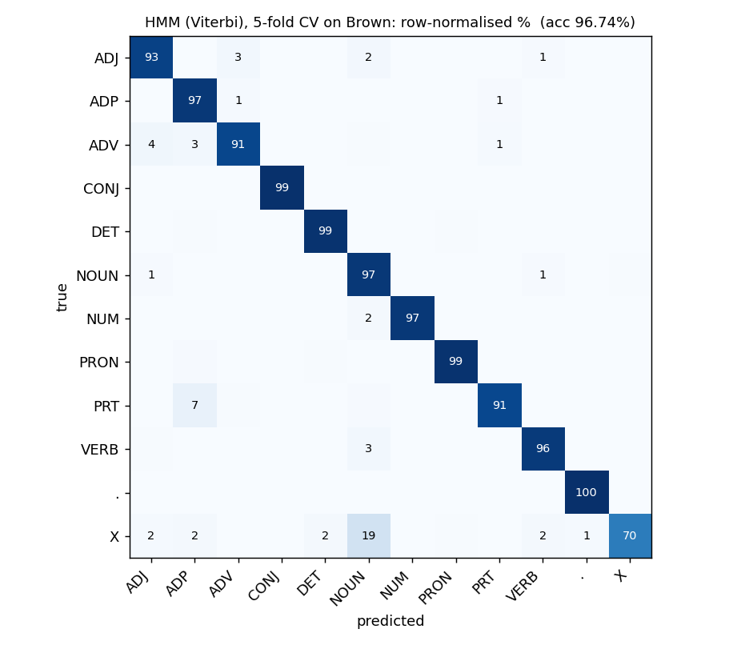

# Part-of-speech tagging on the Brown corpus

Two taggers for the 12-tag universal tagset, built and evaluated on the 1.16M-token Brown corpus: a bigram **hidden Markov model with exact Viterbi decoding** and suffix-based handling of unseen words, and a **two-stage stacked conditional random field** over hand-built lexical features. Both are evaluated at the token level with per-tag breakdowns, and the CRF experiment answers a specific question: does feeding a linear-chain CRF its own predicted previous tag help?

## Results

| Model | Evaluation | Accuracy |
| --- | --- | ---: |
| HMM, Viterbi, suffix backoff | 5-fold CV, 57,340 sentences | **96.74% ± 0.03** |
| CRF, stage 1 (lexical + positional features) | 80/20 split, 11,468 test sentences | **97.43%** |
| CRF, stage 2 (stage 1 features + predicted previous tag) | same split | 97.43% |

Per-tag accuracy, HMM and CRF stage 1:

| Tag | HMM | CRF | Support (HMM CV) |
| --- | ---: | ---: | ---: |
| `.` | 99.94 | 100.00 | 147,565 |
| CONJ | 99.46 | 99.66 | 38,151 |
| DET | 98.66 | 99.44 | 137,019 |
| PRON | 98.52 | 98.32 | 49,334 |
| ADP | 96.87 | 98.39 | 144,766 |
| NOUN | 96.76 | 97.74 | 275,558 |
| NUM | 96.57 | 91.80 | 14,874 |
| VERB | 96.09 | 97.52 | 182,750 |
| ADJ | 93.22 | 92.11 | 83,721 |
| ADV | 91.02 | 92.04 | 56,239 |
| PRT | 90.75 | 93.54 | 29,829 |
| X | 70.78 | 41.83 | 1,386 |

<p align="center"></p>

The confusions are the ones a linguist would predict. Particles are taken for prepositions 7% of the time (*give **up*** vs *up the hill*, identical word, different tag). Adverbs drift toward adjectives and prepositions. The catch-all `X` tag (foreign words, typos, symbols) is mostly guessed as `NOUN`, which for an unknown token is the sensible prior. The CRF's one clear weakness against the HMM is `NUM`: its features don't include a digit-shape feature, so number-like tokens lean on context alone.

**Stacking does nothing.** The second CRF stage, which sees stage 1's predicted tag for the previous word, matches stage 1 to two decimal places, with per-tag differences of a few hundredths of a percent in both directions. A linear-chain CRF already models tag-to-tag transitions as first-class parameters, so a noisy prediction of the same quantity carries no new information. It was worth testing; the result is a clean negative.

## How the HMM handles unseen words

2.6% of test tokens in each fold never appear in training. For those, the emission P(word | tag) is replaced by a suffix estimate: statistics for the last 1 to 3 characters, with a capitalisation flag, are collected from rare training words (frequency ≤ 5), which behave most like unseen ones. The longest suffix with data wins. This is what gets

```
Zorbulating frobnicators quickly xylophoned .
   VERB          NOUN        ADV     VERB   .
```

from a model that has never seen any of those words. Emission and transition tables use additive smoothing; `alpha = 0.01` was chosen on a validation slice carved from a training fold (add-one smoothing, the textbook default, costs 2.5 points on a 50k-word vocabulary).

## Run it

```sh
pip install -r requirements.txt
pytest tests/                      # ~1 s, synthetic corpus, no download

python scripts/eval_hmm.py         # 5-fold CV, ~20 s, writes results/hmm_cv.json
python scripts/eval_crf.py         # trains both CRF stages, ~2 min, writes results/crf_test.json and models/
python app.py                      # Gradio demo, HMM and CRF side by side
```

Brown and the universal tagset are fetched through NLTK on first use.

## Layout

```
postag/
  data.py       Brown loader, k-fold split by sentence
  hmm.py        HMMTagger: fit, Viterbi decode, suffix backoff
  crf.py        feature extractor, StackedCRF (python-crfsuite)
  evaluate.py   accuracy, per-tag accuracy, confusion matrix
scripts/        eval_hmm.py, eval_crf.py
tests/          five fast checks, including one that would fail for a greedy decoder
results/        metrics JSON and the confusion figure
notebooks/      the original exploratory notebooks
app.py          Gradio demo
```

## Provenance

The notebooks in `notebooks/` are where this started. Two things were wrong in the HMM one and are fixed in the package: its decoder chose each tag greedily from the previous choice rather than searching over paths, and its cross-validation estimated the model on the full corpus before splitting, so no test word was ever actually unseen. The CRF notebook's feature design and stacking idea are kept as they were, with a capitalisation feature and L1/L2 regularisation added.

## Author

Arnav Agarwal, IIT Bombay. [arnavagarwal05.github.io](https://arnavagarwal05.github.io)
